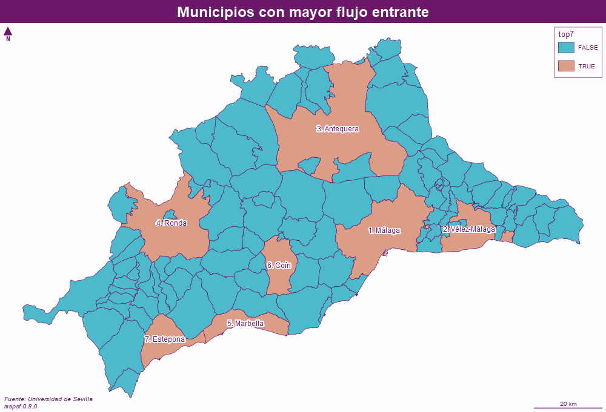
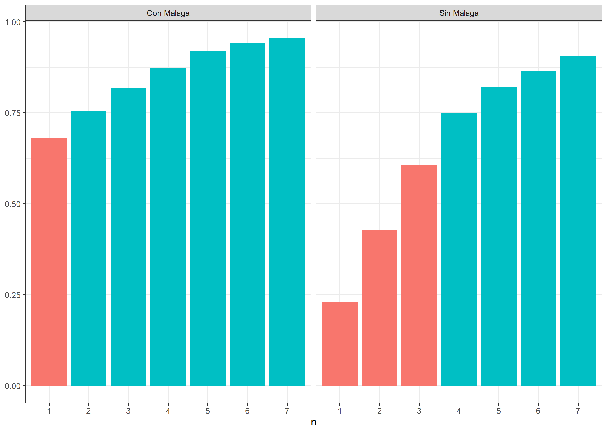

```{r setup, include=FALSE}
knitr::opts_chunk$set(echo = TRUE, warning = FALSE, message = FALSE)
library(dplyr)
library(tidyr)
library(mapsf)
library(stringr)
library(readxl)
library(sf)
library(ggplot2)
library(kableExtra)
```

\newpage
# Introducción

En este trabajo proponemos una agrupación comarcal para la provincia de Málaga basándonos en los flujos de población entre municipios y la situación geográfica de los mismos. Cada municipio tendrá una cabecera y las comarcas estarán formadas por municipios colindantes.

## Contexto

En contraposición con otras comunidades españolas, las comarcas no son una figura arraigada en Andalucía a pesar de que se contemple en su estatuto de autonomía. En concreto Málaga no considera la comarca una agrupacón territorial como tal. Sin embargo las funciones públicas requieren cierta organización territorial. Para ello es necesario delimitar una estructura con mayor desagregación que la provincia que abarque más territorio que el municipio: La comarca

## Objetivos

\begin{itemize}

  \item Proponer agrupaciones comarcales tales que:

  \begin{enumerate}
    \item Tengan una única cabecera
    \item Estén justificadas en sentido geográfico
    \item Cumplan las condiciones necesarias de colindancia\footnote{Todos los municipios de una comarca estén conectados a través de sus fronteras} y dependencia\footnote{La afluencia de personas hacia la cabecera sea considerableme}
    \item Sean exhaustivas\footnote{Todos los municipios se incluyan en una comarca} y exclusivas\footnote{Cada municipio pertenezca únicamente a una comarca}
  \end{enumerate}

  \item Presentar un análisis descriptivo y gráfico que:

  \begin{enumerate}
    \item Permita caracterizar la tipología y dirección de los flujos 
    \item Facilite la propuesta de cabeceras comarcales
    \item Compare los flujos de múltiples municipios
  \end{enumerate}
  
  \item Matizar, modificar, representar y resumir los resultados obtenidos.
  
\end{itemize}


## Estructura

\begin{enumerate}

\item Metodología

\begin{enumerate}

  \item Estudio descriptivo de los datos
  \item Herramientas utilizadas

\end{enumerate}

\item Agrupación comarcal

\begin{enumerate}

  \item Ponderación de los criterios
  \item Selección de cabeceras
  \item Adhesión de municipios
  \item Análisis de sensibilidad

\end{enumerate}

\item Conclusiones
\item Annexo

\end{enumerate}

\newpage

# Metodología

## Datos

### Municipios de la provincia de Málaga

Trabajamos sobre la provincia malagueña con divisiones anivel municipal. Por tanto disponemos de las delimintaciones de cada localidad en un fichero de datos vectorial, en este caso con extensión *shapefile*. 

A partir de éste, contando con las herramientas que describimos en la sección siguiente, obtendremos las relaciones geográficas de carácter espacial que necesitemos. Por ejemplo colindancia de fronteras municipales, distancia entre centroides, área o perímetro municipal; entre otros.

Por otra parte, los datos vectoriales serán esenciales para representar gráficamente las relaciones entre municipios que implican los flujos de población. La representación gráfica nos ayudará a analizar la dirección de los flujos y matizar las agrupaciones comarcales.

### Flujos de población entre municipios

La medida básica que empleamos para representar la dependencia entre municipios es el flujo de personas entre éstos. Para ello contamos con información sobre el flujo de personas que se desplazan habitualmente de un municipio a otro según el motivo del desplazamiento.

Es decir, los flujos tienen una variable que indica de qué municipio procede la población desplazada y otra que denota la localidad hacia la que se dirige el flujo en cuestión. Los municipios están codificados según el identificador que les asigna el [INE](https://www.ine.es/daco/daco42/codmun/codmunmapa.htm). Para cada flujo disponemos de 7 motivos de desplazamiento distintos. Ésta es la forma que tienen los flujos al importalos:

```{r}
source("scripts/import.R") # importamos los datos
head(flux) 
```

La fuente de los datos es una encuesta **¿realizada por la Universidad de Sevilla?**. Notamos que las observaciones cuentan con números decimales a pesar de representar un número d epersonas, entero. Se debe a que la encuesta se realizó sobre parte de la población municipal y se extrapoló al conjunto de la población multiplicando por el ratio población/enquestados para cada localidad.

Dada la dificultad de comparar múltiples criterios (tipología de flujo) al mismo tiempo, hemos decidido agregar las tipologías ponderándolas. Exponemos una justificación más detallada en el [primer apartado de la agrupación comarcal][Ponderación]. Adicionalmente hemos relizado un análisis de sensibilidad sobre las ponderaciones para comprobar la influencia que tienen éstas en la agrupación final.

## Herramientas

Manejamos los datos que hemos introducido en la sección anterior usando las herramientas que describimos brevemente a continuación, basadas en el software [R](https://www.r-project.org/).

\begin{enumerate}
  \item R
  \item Paquetes
  \item Scripts y funciones
  \item Git y Github
\end{enumerate}

\newpage
# Agrupación


## Ponderación
**Juestifcación de los pesos**

## Cabeceras

## Adhesión

## Sensibilidad

\newpage
# Conclusiones

\newpage
# Annexo

{fig.align='center'}
{fig.align='center'}

