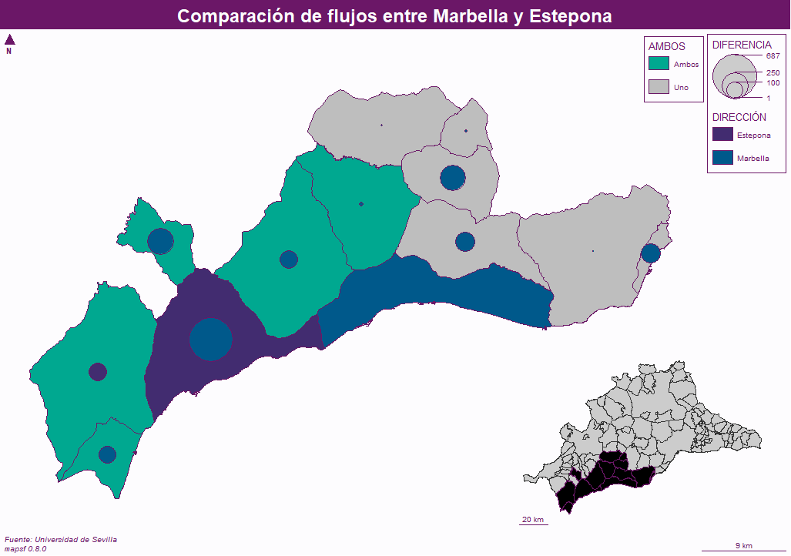

```{r setup, include=FALSE}
knitr::opts_chunk$set(echo = TRUE, warning = FALSE, message = FALSE, fig.pos = "H", out.extra = "")
library(dplyr)
library(tidyr)
library(mapsf)
library(stringr)
library(readxl)
library(sf)
library(ggplot2)
library(knitr)
library(kableExtra)
```

\newpage
# Introducción

En este trabajo proponemos una agrupación comarcal para la provincia de Málaga basándonos en los flujos de población entre municipios y la situación geográfica de los mismos. Cada municipio tendrá una cabecera y las comarcas estarán formadas por municipios colindantes.

## Contexto

En contraposición con otras comunidades españolas, las comarcas no son una figura arraigada en Andalucía a pesar de que se contemple en su estatuto de autonomía. En concreto Málaga no considera la comarca una agrupacón territorial como tal. Sin embargo las funciones públicas requieren cierta organización territorial. Para ello es necesario delimitar una estructura con mayor desagregación que la provincia que abarque más territorio que el municipio: La comarca

## Objetivos

\begin{itemize}

  \item Proponer agrupaciones comarcales tales que:

  \begin{enumerate}
    \item Tengan una única cabecera
    \item Estén justificadas en sentido geográfico
    \item Cumplan las condiciones necesarias de colindancia\footnote{Todos los municipios de una comarca estén conectados a través de sus fronteras} y dependencia\footnote{La afluencia de personas hacia la cabecera sea considerableme}
    \item Sean exhaustivas\footnote{Todos los municipios se incluyan en una comarca} y exclusivas\footnote{Cada municipio pertenezca únicamente a una comarca}
  \end{enumerate}

  \item Presentar un análisis descriptivo y gráfico que:

  \begin{enumerate}
    \item Permita caracterizar la tipología y dirección de los flujos 
    \item Facilite la propuesta de cabeceras comarcales
    \item Compare los flujos de múltiples municipios
  \end{enumerate}
  
  \item Matizar, modificar, representar y resumir los resultados obtenidos.
  
\end{itemize}


## Estructura

\begin{enumerate}

\item Metodología

\begin{enumerate}

  \item Estudio descriptivo de los datos
  \item Herramientas utilizadas

\end{enumerate}

\item Agrupación comarcal

\begin{enumerate}

  \item Ponderación de los criterios
  \item Selección de cabeceras
  \item Adhesión de municipios

\end{enumerate}

\item Conclusiones
\item Annexo

\end{enumerate}

\newpage

# Metodología

## Datos

### Municipios de la provincia de Málaga

Trabajamos sobre la provincia malagueña con divisiones anivel municipal. Por tanto disponemos de las delimintaciones de cada localidad en un fichero de datos vectorial, en este caso con extensión *shapefile*. 

A partir de éste, contando con las herramientas que describimos en la sección siguiente, obtendremos las relaciones geográficas de carácter espacial que necesitemos. Por ejemplo colindancia de fronteras municipales, distancia entre centroides, área o perímetro municipal; entre otros.

Por otra parte, los datos vectoriales serán esenciales para representar gráficamente las relaciones entre municipios que implican los flujos de población. La representación gráfica nos ayudará a analizar la dirección de los flujos y matizar las agrupaciones comarcales.

### Flujos de población entre municipios

La medida básica que empleamos para representar la dependencia entre municipios es el flujo de personas entre éstos. Para ello contamos con información sobre el flujo de personas que se desplazan habitualmente de un municipio a otro según el motivo del desplazamiento.

Es decir, los flujos tienen una variable que indica de qué municipio procede la población desplazada y otra que denota la localidad hacia la que se dirige el flujo en cuestión. Los municipios están codificados según el identificador que les asigna el [INE](https://www.ine.es/daco/daco42/codmun/codmunmapa.htm). Para cada flujo disponemos de 7 motivos de desplazamiento distintos. Ésta es la forma que tienen los flujos al importalos:

```{r}
source("scripts/import.R") # importamos los datos
head(flux) 
```

La fuente de los datos es una encuesta proporcionada por la Universidad de Sevilla. Notamos que las observaciones cuentan con números decimales a pesar de representar un número de personas, entero. Se debe a que la encuesta se realizó sobre parte de la población municipal y se extrapoló al conjunto de la población multiplicando por el ratio población/enquestados para cada localidad.

Dada la dificultad de comparar múltiples criterios (tipología de flujo) al mismo tiempo, hemos decidido agregar las tipologías ponderándolas. Exponemos una justificación más detallada en el primer apartado de la agrupación comarcal. 

## Herramientas

Manejamos los datos que hemos introducido en la sección anterior usando las herramientas que describimos brevemente a continuación, basadas en el software libre [R](https://www.r-project.org/).

Trabajamos usando R con intención de aprender a usar la herramienta para el tratamiento de datos y cuestiones relacionadas con la geografía. Para ello empleamos algunos paquetes muy conocidos como [dplyr](https://dplyr.tidyverse.org/) o [tidyr](https://tidyr.tidyverse.org/) para el manejo de datos generales, [sf](https://r-spatial.github.io/sf/) para el procesamiento de datos de SIG y [mapsf](https://riatelab.github.io/mapsf/) o [ggplot2](https://ggplot2.tidyverse.org/) para la representación gráfica de éstos, también usamos [bookdown](https://bookdown.org/) para la redacción del trabajo. 

Por otra parte hemos usado control de versiones [GIT](https://git-scm.com/) en el repositorio de [Github](https://github.com/) que se encuentra en [este enlac](https://github.com/pompolompo/comarcas). Ahí se almacena todo lo que ha sido necesario a lo largo del trabajo, así como un historial de verisones. Se pueden encontrar carpetas con los gráficos, otras con funciones de utilidad (por ejemplo para pasar de identificador comarcal a nombre) y otras con scripts que contienen el procesamiento de los datos de flujos, creación de tablas y gráficos.

# Agrupación
```{r}
source("grafs/tab_script.R")
```

Hemos dividido el proceso de agrupación comarcal en 5 partes:

\begin{enumerate}
  \item Breve análisis descriptivo de los flujos: Con tal de hacernos una idea general de los flujos de personas entre municipios tratamos de responder a cuestiones cómo ¿Por qué se desplazan las personas? ¿Hacia dónde? ¿En qué medida?
  \item Ponderación de los criterios: Proponemos pesos para agregar los criterios basándonos en la importancia de cada motivo de desplazamiento. También usamos varios estadísticos teniendo en cuenta el número de municipios dependientes y la distancia. Normalizamos los estadísticos. 
  \item Selección de cabeceras: Usamos representaciones gráficas para contextualizar geográficamente la información de los flujos. Nos hacemos una idea de qué municipios contendrá cada comarca.
  \item Adhesión de municipios: Comparaciones pertinentes de los municipios con asignación comarcal no evidente.
\end{enumerate}

\newpage
## Descriptiva

### Tipología de los motivos de desplazamiento

Veamos qué cantidad de personas se desplaza según el motivo. Para ello la tabla 1 recoge la proporción de flujos que causa cada una de las tipologías. Por otra parte hemos calculado los kilómetros que se recorren en función del motivo del desplazamiento, los hemos representado en la misma tabla. También se pueden consultar los gráficos correspondientes en el annexo.

```{r, echo = FALSE, out.width="75%", fig.align='center', fig.show='hold'}
desplaza
```

El motivo mayoritario de los desplazamientos es el administrativo, prácticamente uno de cada tres desplazamientos responde a esta causa. Lo siguen otra tipología especialmente relevante para el sector público: Los motivos educativos corresponden a uno de cada cinco desplazamientos intermunicipales dentro de la provincia de Málaga. Entonces más de la mitad de desplazamientos se hacen por motivos administrativos o de educación. A éstos les siguen las motivaciones comerciales y de sanidad, luego en medida bastante menor ocio, transportes y otros generan en conjunto menos de un 15% de los desplazamientos. Los kilómetros recorridos tienen un orden y medida similar al número de desplazamientos.

```{r descr-1, echo = FALSE, out.width="70%", fig.align='center', fig.show='hold'}
#| fig.cap = "Cantidad de personas desplazadas según el motivo."
include_graphics("grafs/descr_1.png")
```

\newpage
### Destinos de los flujos

Ahora nos fijamos en las localidades que reciben mayor afluencia de personas, la tabla 3 muestra los 7 municipios que son destino de mayor flujo total. También se puede leer la cantidad de municipios que dependen de cada uno de ellos. Más allá de los criterios puramente numéricos, para la agrupación comarcal es importante fijarse en la situación geográfica de los municipios ya que conviene seleccionar cabeceras que alberguen desplazamientos de zonas diferentes. Veamos dónde están situados los siete candidatos anteriores. Para ello nos fijamos en la figura 1, que sitúa los 7 municipios de la tabla en el mapa.

```{r, echo=FALSE, fig.show='hold'}
top7
```

Apreciamos una diferencia muy importante entre el primer destino más importante y el segundo. La capital malagueña recibe flujos de prácticamente todas las localidades de la provincia (91 de 102), los desplazamientos totales hacia Málaga son 9 veces mayores que hacia Vélez-Málaga, la segunda localidad con más dependencias. Sospechamos que tras ponderar los motivos seguirá liderando la lista con diferencia. 

```{r, echo = FALSE, out.width = "80%", fig.align='center', fig.show='hold'}
#| fig.cap = "Localización de los 7 municipios con mayor afluencia"
include_graphics("grafs/descr_2.png")
```

Notamos que los 7 municipios más importantes cubren relativamente bien la extensión de la provincia, sin embargo hay algunas cuestiones que requieren especial atención: No conviene que las cabeceras estén muy cercanas entre sí ya que en tal caso los competirán por los flujos de localidades entre ellas. También es preferible que las cabeceras estén alejadas ya que así se cubrirá la provincia completa con un menor número de cabeceras sin que sean excesivamente grandes. En este caso Estepona y Marbella son colindantes. También vemos que Málaga y Vélez-Málaga están reltivamente cerca. Probablemente tendremos que decidir con qué cabecera nos quedamos para cada pareja. Sin embargo existen criterios discordantes: Marbella recibe mayor afluencia que Estepona, pero ésta última está más lejos de otras cabeceras y es posible que recoja los flujos de una zona en particular. Más adelante trataremos estas cuestiones en mayor profundidad.

Una cuestión no menos importante es la abismal diferencia entre la capital y el resto de municipios en cuanto a la categoría de destino de flujos. Como hemos visto antes, Málaga recibe muchos más desplazamientos que cualquier otro municipio. Vemos si ocurre lo mismo, en menor medida, con las siguientes localidades de la lista. El gráfico de la figura 2 ilustra la proporción de flujos que reciben los destinos más importates respecto al total, se pinta en rojo los grupos que no alcanzan el 75% de los flujos.

```{r, echo = FALSE, out.width = "80%", fig.align='center'}
#| fig.cap = "Proporción de flujos recibidos por los n municipios con mayor afluencia. 
#| Se distingue el caso con la capital y si ella.
#| En azul los númeeros de destinos que conjuntamente superan el 75% de los flujos totales"

```

Vemos que existe una diferencia importante entre el caso en el que tenemos en cuenta la capital y el caso en el que no. En el primero, con dos municipios ya acumulamos tres de cada cuatro desplazamientos mientras que en el segundo se necesitan almenos cuatro municipios. Así remarcamos la relevancia de Málaga para toda la provincia.

\newpage
## Ponderación, normalización y agragación

Es más sencillo tomar decisiones si consideramos una única medida que si tenemos en cuenta varias, pero si solo nos fijamos en un criterio perderemos información sobre la situación. En este apartado motivamos, explicamos y justificamos el proceso que nos lleva de múltiples medidas a una única. Hemos tenido en cuenta dos características al poderar los flujos: La tipología del motivo de desplazamiento y la localización demográfica en términos de distancia de un municipio a otro. 

Por un lado la tipología: Algunos motivos de desplazamientos son más importantes desde el punto de vista de la agregación comarcal que otros, por tanto calculamos una media ponderada en función de la importancia que le asignamos a cada motivo. Cabe remarcar que, a pesar de contar con una justificación, dichas ponderaciones heredan un punto de vista subjetivo y por ende son suceptibles de un análisis de sensibilidad. Las ponderaciones que utilizamos son las siguientes:

```{r, echo = FALSE}
pondera
```

Enseñanza y sanidad son dos servicios mayormente cubiertos por organismos públicos, por tanto los consideramos muy importantes al realizar las agrupaciones comarcales. La función administrativa también es clave en para, pero ligeramente menos. Luego ocio y cultura, transportes y comercio tienen una importancia relativamente reducida en comparación con los anteriores. Finalmente aquellos desplazamientos que no entran en ninguna de las categoría anteriores son menos pertinentes para la agrupación comarcal porque no están relacionados estrechamente con el sector público.

Por otro lado la situación geográfica: Nos interesa seleccionar un número de cabeceras y comarcas adecuado, que cubran la totalidad de la provincia. De manera que es importante que las cabeceras seleccionadas sean de vital importancia sobre todo para los municipios de la comarca, es decir aquellos que se encuentren cerca de ésta. Los flujos recibidos desde lejos también se deben tener en cuenta pues indican que el municipio en cuestión es importante, pero en menor medida con tal de seleccionar comarcas estrechamente relacionadas con municipios cercanos. Para contabilizarlo hemos ponderado los flujos intermunicipales según la distancia que separa el municipio de origen y el destino en kilómetros.

Así pues usaremos múltiples medidas agregadas que tenemos que volver a agregar para convertitir en una. Para poder hacerlo éstas deben estar en la misma escala. La solución que proponemos es usar el método Nadir, que consites en reescalar todas la medidas a un rango entre cero y uno. Siendo el máximo igual a uno y el mínimo igual a cero. Las nuvas medidas normalizadas ($y_i$) las da el siguiente cálculo donde las medidas sin normalizar son $x_i$:

$$
y_i = \frac{x_i - \min(x)}{\max(x) - \min(x)} 
$$

Otra cuestión de interés es la medida escogida para representar la dependencia: Tenemos en cuenta la suma y la media porqué nos aportan información ligeramente distinta. Es sencillo de ilustrar con un ejemplo: Si un municipio tiene un único flujo entrante relativamente alto tendrá una suma baja mientras que su media será alta. Este es el caso de Fuengirola, que sólo recibe desplazamientos desde Mijas, pero en una cantidad considerable. Por otra parte un municipio como Ronda tiene un total de 24 municipios dependientes y la cuarta suma más alta (sin ponderar), en cambio si nos fijamos en su media es la novena ya que a ese total contribuyen muchas localidades. De modo que para tener en cuenta ambos estadísticos hemos agrgado las todas las medidas normalizadas calculando su media aritmética. Finalmente volvemos a apliar la normalización para facilitar la interpretación.

```{r, echo = FALSE, fig.align='center', out.width="75%"}

```


\newpage
## Cabeceras

Ahora que hemos reducido los múltiples criterios a uno solo, veamos qué municipios son los que reciben mayor afluencia de personas desde otras localidades. Podemos interpretar la cantidad entrante como el ratio de puntuación en comparación con el municipio más importante, Málaga.

```{r, echo = FALSE, fig.align='center', out.width="50%"}
norma0
```

Nos fijamos en alguna anomalía, como hemos comentado antes, Fuengirola tiene una media muy alta a consecuencia de recibir a muchas personas únicamente dese un municipio: Por esa razón se encuentra en una posición tan alta. Si no consideramos a municipios de los que dependan pocas localidades, por ejemplo filtramos para visualizar municipios con almenos cuatro localidades dependientes y además dejamos a parte a la capital de provincia estos son los 10 municipios más importantes:

```{r, echo = FALSE, fig.align='center'}
norma1
```

Destacan Antequera y Marbella, luego existe un grupo intermedio en el que se encuentran Coín, Estepona, Vélez-Málaga, Torremolinos y Ronda. Los últimos tres municipios reciben una afluencia bastante menor, pero no los podemos descartar aún. Es posible que su localización geográfica o los municipios de los que provienen sus flujos sean convenientes para su selección como cabecera. Veamos ahora dónde se encuentran en el mapa, después evaluaremos qué municipios son candidatos a primera vista y cuales habrá que comparar para quedarse con uno de ellos.

```{r, echo = FALSE, out.width = "100%", fig.align='center', fig.show='hold'}
#| fig.cap = "Localización de los 10 municipios con mayor afluencia normalizada
#|  sin contar con Málaga ni Fuengirola."

```

Empezamos por considerar a los candidatos que se encuentran lejos de otros. Ronda está relativamente alejado de otras potenciales cabeceras y cubre relativamente bien parte del oeste de la provincia.

Si nos fijamos en la parte más hacia el norte notaremos que Antequera, Álora y Campillo están colindando. Probablemente habrá que escoger solo a uno de estos tres. La situación geográfica favorece a Antequera dado que se encuentra más alejada de otras posibles cabeceras y más cerca de los extremos al noreste de la provincia. Desde este punto de vista también hay que tener en cuenta que tanto su área como su perímetro son considerablemente más extensos que los de Álora o Campillo. Otro argumento es que el flujo que recibe es mayor al que reciben los otros dos municipios. Sin embargo habrá que examinar de dónde vienen esos flujos y si Antequera es una buena cabecera para esta zona de Málaga.

Nos dirigimos ahora hacia el suroeste de la provincia, allí vemos que hay otras dos posibles cabeceras colindando: Estepona y Marbella. En este caso los argumentos cartográficos no son tan evidentes. Ambas tienen una extensión similar y pueden recibir flujos de localidades cercanas. A favor del caso de Estepona podemos decir que no hay otros candidatos más hacia el oeste y que si la ciudad recibe los flujos de estas localidades tendría justificada la categoría de cabecera comarcal. Por otra parte en general Marbella recibe más afluencia y también podría recibir los flujos de una zona sin muchos candidatos. Si bien es cierto que al este y al norte de Marbella hay algunos municipios que aspiran a ser cabecera su estatus no es del todo cierto y, si no lo fueran Marbella podría abastecer a los municipios de la zona. No obstante cabe la posibilidad de que dos cabeceras se toquen, a pesar de que no parezca una solución favorable a primera vista, en función de la procedencia de los flujos de estas localidades y de la elección de otras cabeceras sería razonable que Estepona y Málaga fueran cabeceras de comarcas distintas.

Fijémonos ahora en el extremo oeste de la provincia, allí vemos que hay dos candidatos a cabecera: Vélez-Málaga y Nerja. Esta última se encuentra en la frontera provincial y podría atraer flujos de esa zona. Sin embargo, en general no recibe una gran afluencia. Podríamos tomar varias decisiones en función del lugar de dónde provengan los flujos: Si Nerja recoge los flujos de sus alrededores y no depende  mucho de Vélez-Málaga podría ser la cabecera de la zona más hacia el oeste. Si por lo contrario Vélez-Málaga recoge bien los desplazamientos de la zona ésta sería la única cabecera. Una tercera opción es considrear a la capital provincial también capital comarcal, en este caso Vélez-Málaga ya no sería cabecera justificando así la categoría para Nerja. Esta decisión dependerá en gran medida de las otras cabeceras seleccionadas.

Finalmente consideramos a Coín y Torremolinos, que se encuentran entre todos los grupos de cabeceras comentadis anteriorment. Al norte tienen a Álora y Antequera, al oeste está Marbella y al este se encuentra la capital provincial al lado de Vélez-Málaga. Como consecuencia de esta situación geográfica y de forma similar al grupo anterior, su selección dependerá en buena medida de qué cabeceras sean seleccionadas en el resto de casos. Siempre y cuando la procedencia de sus flujos sea la adecuada y la zona necesite ser cubierta por una cabecera podrán ser seleccionadas como cabecara.

De modo que el siguiente paso es plantearse una serie de comparaciones entre candidatos que estén ordenadas de menos dependiente de otras selecciones a más dependiente de otras selecciones. Realizaremos comparaciones dos a dos en cada grupo y tomaremos una decisión, seguidamente pasaremos a las comparaciones del siguiente grupo teniendo en cuenta la selección anterior. El orden de comparaciones será el siguiente:

\begin{enumerate}
  \item Partimos de:
  \begin{itemize}
    \item Ronda es cabecera porqué en zu zona no rivaliza con nadie
    \item Málaga formará una comarca por sí sola: Es importante y no depende de ningún municipio
  \end{itemize}
  con Ronda como cabecera y Málaga capita queda excluida
  \item Antequera, Campillos y Álora
  \item Marbella y Estepona
  \item Vélez-Málaga y Nerja
  \item Torremolinos y Coín
\end{enumerate}

Cabe remarcar que al seleccionar las cabeceras también consideramos los municipios que se adherirán a cada una de ellas. Por tanto tendremos una idea más o menos clara de cuál será la agrupación comarcal final. Sin embargo surgirán dudas al respeco de algunos municipios qu resolveremos en el apartado siguiente. Para realizar dicha selección emplearemos una tipología de figura que introducimos a continuación.

El siguiente gráfico condensa información de varios tipos. Trabaja con los flujos sin transformar, es decir representando la cantidad de personas que se desplazan de un municipio a otro. Compara dos municipios que son potencialmente cabeceras así que lo hace desde la perspectiva de éstos como destino. Pretende representar el lugar de origen  de los flujos y la medida de los mismos en pro de la comparación de destinos.

Dibujamos los municipios que comparamos y aquellos que dependen de alguno de ellos, los pintamos de tres colores: Por un lado el azul y el morado se indentifican con un destino u otro. Por otro lado el verde y el gris nos dan aportan información sobre la localidad de origen, si ésta depdende de ambos destinos la pintamos en verde y si solo depende de uno en gris. Adicionalmente trazamos un mapa  más pequeño de la provincia entera que nos sirve para contextualizar la localización de los municipios que representamos en la parte principal.

La característica más importante de esta figura son los círculos coloreados que encontramos en los centroides de las localidades de origen: Corresponden a la diferencia de flujo entre los dos municipios, el color nos informa de qué destino es más importante para éste y su tamaño es proporcional a la dimensión de la diferencia. Así en los municipios de origen pintados de gris la cantidad utilizada para calcular el color y radio del cículo es simplemente el flujo hacia su destino. Sin embargo en los orígenes pintados de verde la cantidad utilizada es la diferencia entre el flujo en una dirección y la otra.

\newpage
### Antequera y Campillos

En la figura 4 podemos comprobar que Antequera es destino de desplazamientos desde prácticamente la totalidad de los municipios situados al noreste de la provincia. Por otro lado Campillos atrae flujos de menos localidades, todas situadas al oeste de Antequera. Sin embargo, en términos generales, aquellos municipios que envían flujos a Campillos también lo hacen a Antequera en mayor medida. Por tanto concluimos que Antequera es una cabecera satisfactoria y puesto que también abarca los municipios que dependen de Campillos, éste último municipio no será cabecera.

```{r, echo = FALSE, out.width = "100%", fig.align='center', fig.show='hold'}
#| fig.cap = "Comparación de Antequera y Campillos como potenciales cabeceras
#|  según la procedencia y origen de sus flujos."

```

\newpage
### Antequera y Álora

En la figura 5 equiparamos Antequera y Álora. En contraste con la anterior comparación esta pareja recibe flujos de localidades distintas, es decir son focos de influencia para zonas diferentes. Este característica favorece la selección de ambas localidades como cabecera. Adicionalmente Álora atrae flujos de una zona que no tiene una cabecera clara. De modo que Antequera y Álora pueden coexistir como cabeceras ya que sus zonas de influencia se complementan bien. No obstante la categoría de cabecera para Álora dependerá de su comparación con otras potenciales cabeceras que puedan abarcar los flujos de la misma zona, como Coín.

```{r, echo = FALSE, out.width = "100%", fig.align='center', fig.show='hold'}
#| fig.cap = "Comparación de Antequera y Álora como potenciales cabeceras
#|  según la procedencia y origen de sus flujos."

```

\newpage
### Marbella y Estepona

Nos diriguimos ahora al suroeste de la provincia fijándonos en la figura 6, en la que contraponemos Marbella y Estepona. Vemos que a pesar de los argumentos de localización geográfica a favor de Estepona que habíamos comentado en secciones anteriores Marbella recibe flujos de todos los municipios que desplazan personas hacia Estepona y casi siempre en mayor medida. Adicionalmente Estepona depende de la misma Marbella en una cantidad considerable. Por lo tanto resulta más adecuado seleccionar a Marbella como cabecera eliminando así la posibilidad de que Estepona ostente el mismo estatus.

```{r, echo = FALSE, out.width = "100%", fig.align='center', fig.show='hold'}
#| fig.cap = "Comparación de Marbella y Estepona como potenciales cabeceras
#|  según la procedencia y origen de sus flujos."

```

\newpage
### Vélez-Málaga y Nerja

Comparamos ahora los dos candidatos del este de la provincia, en la figura 7 se aprecia una situación parecida a la de Estepona y Málaga. Ahora Nerja y Vélez-Málaga se encuentran respectivamente en la misma situación. Por un lado Nerja está situada en el extremo de la provincia, lo que nos invita a pensar que puede recoger la influencia de los municiios de esa zona de una forma ordenada. Pero resulta que los municipios de los cuales Nerja atrae desplazamientos también viajan a Vélez-Málaga y lo hacen en mayor medida. Por otra parte la propia localidad de Nerja presenta un flujo considerable hacia Vélez-Málaga. A consecuencia de los argumentos expuestos, Nerja no será cabecera mientras Vélez-Málaga lo sea. El estatus de cabecera para Vélez-Málaga parece razonable a falta de su contextualización con el resto de cabeceras.

```{r, echo = FALSE, out.width = "100%", fig.align='center', fig.show='hold'}
#| fig.cap = "Comparación de Vélez-Málaga y Nerja como potenciales cabeceras
#|  según la procedencia y origen de sus flujos."
include_graphics("grafs/selec_3.png")
```

En las comparaciones anteriores hemos dado por buena la candidatura de Marbella y no descartamos a Álora como cabecera. Éstas se encuentran en una zona de difícil clasificacón puesto que enmedio existen otros municipios importantes como son Coín y Torremolinos. En las siguientes comparaciones constataremos la coexistencia de estas cuatro localidades en la categoría de cabecera comarcal.

\newpage
### Álora y Coín

Empezamos considerando la comparación entre Álora y Coín. Como era de esperar la zona de influencia de estas dos localidades es similar y se encuentra en el centro de la provincia. Si bien es cierto que en el sur de esta subsección de la provinciaCoín es más importante que Álora y viceversa en el norte hay varios municipios que dependen de ambas localidades. De manera que no parece que ambas localidades puedan ser cabecaras comarcales. En cualquier caso se deberá contextualizar con las comparaciones entre el resto de candidatos de la zona.

```{r, echo = FALSE, out.width = "100%", fig.align='center', fig.show='hold'}
#| fig.cap = "Comparación de Álora y Coín como potenciales cabeceras
#|  según la procedencia y origen de sus flujos."

```

\newpage
### Álora y Torremolinos, Álora y Marbella

Si nos fijamos en la figura 9 notaremos que Álora y Torremolinos tienen zonas de infulencia disjuntas. Eso nos indica que a priori no tiene porqué existir ningún tipo de problemática en la selección simultánea de ambas cabeceras. Lo mismo ocurre en la figura 10 que compara Álora con Marbella. De nuevo, quedará por contextualizar con el resto de comparaciones y selecciones. 

```{r, echo = FALSE, out.width = "75%", fig.align='center', fig.show='hold'}
#| fig.cap = "Comparación de Álora y Torremolinos como potenciales cabeceras
#|  según la procedencia y origen de sus flujos."

```

```{r, echo = FALSE, out.width = "75%", fig.align='center', fig.show='hold'}
#| fig.cap = "Comparación de Álora y Marbella como potenciales cabeceras
#|  según la procedencia y origen de sus flujos."

```

\newpage
### Coín y Marbella, Coín y Torremolinos

En la figura 11 vemos que Coín y Marbella son destino de tres municipios iguales, debemos tener en cuenta que Coín atrae flujos tan solo de ocho localidades. Por otra parte tres de las cinco localidades desde las que se desplazan personas hacia Coín, pero no hacia Marbella, también dependen de Álora como se ve en la figura 8. Por tanto Si Marbella y Álora son cabeceras Coín no debería serlo porque su zona de influencia ya estaría ocupada por Marbella o Álora. Luego, Coín comparte con Torremolinos flujos de un municipio ajeno a Marbella y Álora Alhaurín de la Torre. Siendo esta otra razón para descartar a Coín como cabecera.

```{r, echo = FALSE, out.width = "65%", fig.align='center', fig.show='hold'}
#| fig.cap = "Comparación de Coín y Marbella como potenciales cabeceras
#|  según la procedencia y origen de sus flujos."

```

```{r, echo = FALSE, out.width = "65%", fig.align='center', fig.show='hold'}
#| fig.cap = "Comparación de Coín y Torremolinos como potenciales cabeceras
#|  según la procedencia y origen de sus flujos."
include_graphics("grafs/selec_8.png")
```

\newpage
### Selección

Resumiendo, hemos seleccionado algunas cabeceras más directamente que otras que han requerido de mayor comparación y contextualización tanto geográfica como en cuanto a flujos de dependencia:

Primeramente excluimos a Málaga que por su condición especial de capital de provincia y a consecuencia de que prácticamente todos los municipios dependen de ésta mientras la capital no depende de ningún otro municipio conformará una ciudad comarca con ella misma como única localidad integrante.

Luego nos decidimos por Ronda como cabecera puesto que no hay otras localidades importantes en su zona. Seguidamente comprobamos que Antequera es el municipio más importante del noreste de la provincia y que ésta podría coexistir como cabecaera con Álora, pero no con Campillos. Por tanto Antequera es seleccionada, Campillos descartada y Álora requiere indagar más.

El siguente paso ha sido decidir entre dos pares de municipios relativamente importantes y situados a los extremos de la provincia: Marbella y Estepona en el suroeste y Vélez-Málaga y Nerja en el este. En ambos casos la segunda localidad respecivamente tenía a su favor la localización pues se tanto Nerja como Estepona se encuentran más cerca de los límites de la provincia que sus parejas. Sin embargo el argumento de los flujos ha reultado más importante en ambos casos: Seleccionamos a Marbella sobre Estepona y a Vélez-Málaga sobre Nerja porqué estas influyen a una zona que contiene a las áreas de influencia de sus alternativas.

Por último la zona que se encuentra entre Málaga, Antequera, Ronda y Marbella podía necesitar alguna cabecera más. Coín era una localidad candidata por estar justo en el centro de la zona descrita, sin embargo por esa misma condición de centralidad su zona de influencia se pisa con la de otros municipios importantes. Después de comprobar las compatibilidades y discrepancias entre municipios con flujos destinados hacia Coín, Torremolinos y Álora, hemos seleccionado a la última por su razonable coexistencia con el resto de cabeceras seleccionadas anteriormente.

\newpage
## Adhesión

El último paso será decantar los muncipios que no han sido selecconados como cabeceras hacia alguno de los que sí lo han estado. Para ello usamos criterios de dependencia matizados por las condiciones de colindancia, exhaustividad y exclusividad:

\begin{enumerate}
  \item Si sólo depende de una cabecera se adhiere a su comarca
  \item Si depende de más de una cabecera se adherirá a la que sea más important para el mismo
  \item Si no depende de ninguna cabecera se adherirá según criterios de colindancia y distancia
\end{enumerate}

La figura 13 resume la información geográfica y de dependencia a partir de las cabeceras razonadas en el apartado anterior. En ella vemos si los municipios adheribles dependen de alguna cabecera, o más de una y también cuál.

```{r, echo = FALSE, out.width = "100%", fig.align='center', fig.show='hold'}
#| fig.cap = "Agregaciones comarcales por colores, 
#| las cabeceras tienen los borders más gruesos (Málaga está en negro). 
#| Los municipios con un punto rojo dependen de más de una cabecera. 
#| Los municipios sin pinta dependen de dos cabeceras."

```

Los municipios que dependen de más de una cabecera están recogidos en la tabla 6. A continuación usamos gráficos de flujos para decidir a qué comarca se adhieren estos municipios. Después haremos lo mismo con los que no dependen directamente de ninguna cabecera fijándonos hacia que comarca dirigen sus flujos y, en se defecto según la localización geográfica.

```{r, echo = FALSE}
depende2
```

Debido a la gran cantidad de municipios que quedan por adherir adjuntamos en el annexo la mayoría de los gráficos deflujos. Aquí y su razonamos uno de los csasos para ejemplificar. El resto son muy similares.

Alfarnatejo podría formar arte de la comarca de Vélez-Málaga o Antequera respetando las condiciones de colindancia. Nos fijamos en que la cantidad de desplazamientos hacia una cabecera y otra son similares. Por tanto decidimos en base a la dirección de sus otros flujos: La mayoría apuntan hacia localidades de la provincia de Antequera, luego Alfarnatejo se adherirá a esta.

```{r, echo = FALSE, out.width = "100%", fig.align='center', fig.show='hold'}
#| fig.cap = "Flujos procedentes de Alfarnatejo."

```

\newpage
Por otro lado los municipios que no dependen de ninguna cabecera son:

```{r, echo = FALSE}
dep$ORIGEN[is.na(dep$CABECERA) & !(dep$ORIGEN %in% c("Ronda", "Antequera", "Marbella", "Vélez-Málaga", "Álora"))]
```

Finalmente, la agrupación comarcal definitiva es la siguiente:

```{r, echo = FALSE, out.width = "100%", fig.align='center', fig.show='hold'}
#| fig.cap = "Agrupación comarcal definitiva."

```

\newpage
# Conclusiones

En este trabajo hemos analizado brevemente los flujos entre municipios de la provincia de Málaga para crear agrupaciones comarcales. También nos hemos basado en criterios geográficos como la distancia o la colindancia. Para ello nos hemos apoyado en la síntesis y ponderación de las distintas tipologías de desplazamiento así cómo en múltiples recursos gráficos.

Las comarcas propuestas están compuestas por una cabecera y serie de municipios que dependen de ésta o de otras localidades de la misma comarca. En total hemos agrupado cinco comarcas con Ronda, Antequera, Marbella, Álora y Vélez-Málaga como cabeceras; por otra parte la capital provincial forma una comarca por si sola dada su casuística especial.

Finalmente, la realización de este trabajo nos ha permitido mejorar varias aptitudes tanto en el ámbito geográfico como en el informático: 

\begin{itemize}

  \item Conocer mejor la geografía de la provincia de Málaga
  \item Aprender a tratar con datos vectoriales y representalos en R
  \item Practicar el uso de GIT y Github para el control de versiones

\end{itemize}

Se puede encontrar el repositorio de éste trabajo en [este enlace](https://github.com/pompolompo/comarcas).

\newpage
# Annexo

## Tipología de desplazamientos

```{r descr-2, echo = FALSE, out.width="50%", fig.align='center', fig.show='hold'}
#| fig.cap = "Cantidad de personas desplazadas según el motivo."
include_graphics("grafs/descr_11.png")
```

## Flujos de municipios adheridos

```{r, echo = FALSE, out.width = "80%", fig.align='center', fig.show='hold'}
#| fig.cap = "Flujos procedentes de Almargen."

```

```{r, echo = FALSE, out.width = "80%", fig.align='center', fig.show='hold'}
#| fig.cap = "Flujos procedentes de Cañete la Real."

```

```{r, echo = FALSE, out.width = "80%", fig.align='center', fig.show='hold'}
#| fig.cap = "Flujos procedentes de Teba."

```

```{r, echo = FALSE, out.width = "80%", fig.align='center', fig.show='hold'}
#| fig.cap = "Flujos procedentes de Alfarnate."

```

```{r, echo = FALSE, out.width = "80%", fig.align='center', fig.show='hold'}
#| fig.cap = "Flujos procedentes de Riogordo."
include_graphics("grafs/agrega_m6.png")
```

```{r, echo = FALSE, out.width = "80%", fig.align='center', fig.show='hold'}
#| fig.cap = "Flujos procedentes de Jubrique."

```

```{r, echo = FALSE, out.width = "80%", fig.align='center', fig.show='hold'}
#| fig.cap = "Flujos procedentes de Carratraca."

```

```{r, echo = FALSE, out.width = "80%", fig.align='center', fig.show='hold'}
#| fig.cap = "Flujos procedentes de Ardales."

```

```{r, echo = FALSE, out.width = "80%", fig.align='center', fig.show='hold'}
#| fig.cap = "Flujos procedentes de Benalmádena."

```

```{r, echo = FALSE, out.width = "80%", fig.align='center', fig.show='hold'}
#| fig.cap = "Flujos procedentes de Totalán."

```

```{r, echo = FALSE, out.width = "80%", fig.align='center', fig.show='hold'}
#| fig.cap = "Flujos procedentes de Alhaurín de la Torre."

```

```{r, echo = FALSE, out.width = "80%", fig.align='center', fig.show='hold'}
#| fig.cap = "Flujos procedentes de Coín."

```

```{r, echo = FALSE, out.width = "80%", fig.align='center', fig.show='hold'}
#| fig.cap = "Flujos procedentes de Torremolinos."

```